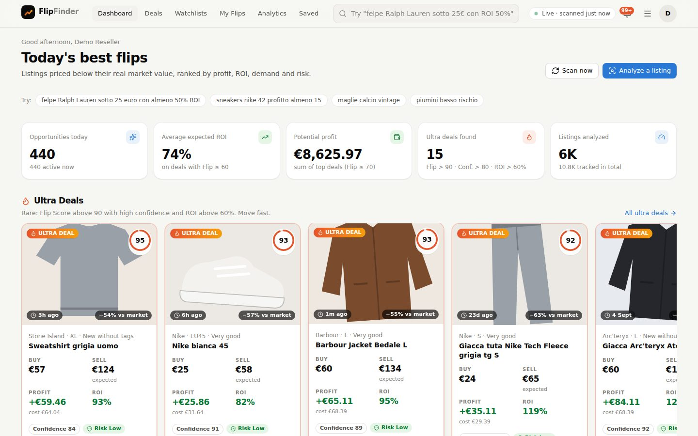
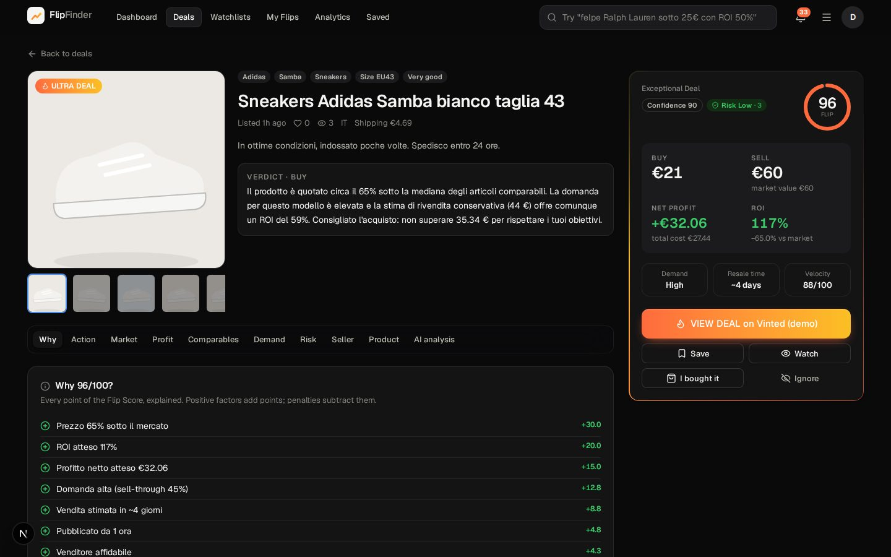
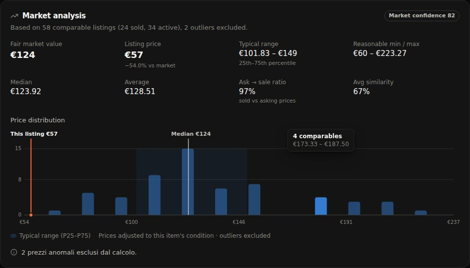
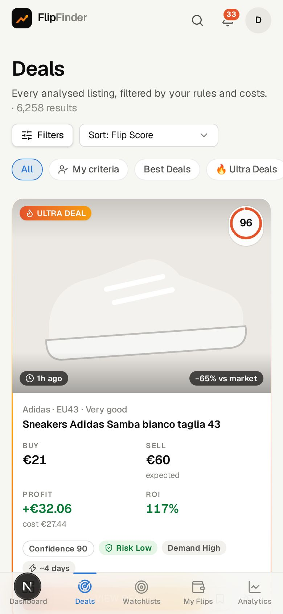
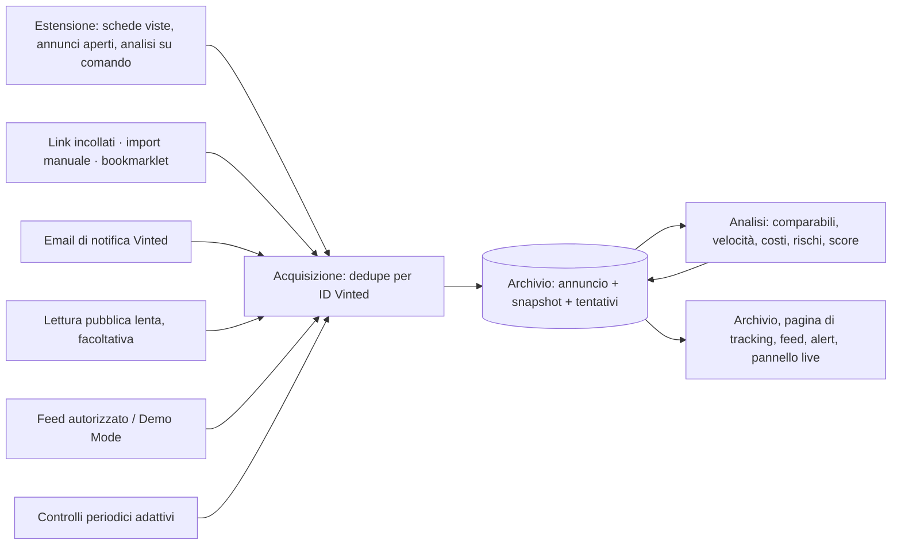
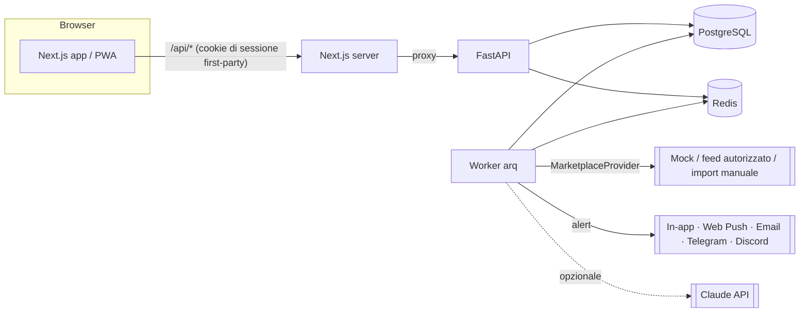

# Vinted FlipFinder

Piattaforma di **marketplace intelligence per il reselling**: trova annunci di abbigliamento
usato prezzati sotto il loro valore di mercato reale e quantifica il profitto ottenibile
rivendendoli, al netto di **tutti** i costi (protezione acquisti, spedizioni, commissioni,
imballaggio, promozioni).

Per ogni annuncio FlipFinder calcola fair market value dai comparabili (outlier esclusi),
tre scenari di rivendita, profitto netto e ROI con i *tuoi* costi, domanda e tempo di vendita,
Flip Score 0–100 spiegato voce per voce, Confidence e Risk separati, prezzo massimo d'acquisto
e prezzo d'offerta suggerito, più un'analisi AI con verdetto BUY / CONSIDER / SKIP.

Ogni annuncio visto finisce in un **archivio permanente**.

- **Cosa registra:** per ogni annuncio, ID Vinted, modalità di acquisizione, data e versione dell'algoritmo, con una "fotografia" a ogni osservazione.
- **Stato aggiornato nel tempo:** attivo, riservato, venduto o rimosso. "Venduto" viene segnato solo con una prova.
- **Pagina di tracking:** galleria completa con copie locali delle foto, storico di prezzo e preferiti, analisi.
- **Estensione per Vinted:** valuta le schede mentre scorri e mostra una **classifica live** nel pannello laterale del browser.
- **Pochi comparabili:** FlipFinder lo dice ("dati insufficienti") invece di inventare una stima.



| Dettaglio opportunità (dark mode) | Analisi di mercato | Mobile |
|---|---|---|
|  |  |  |

> **Principi.**
> - FlipFinder legge ciò che **tu** apri: estensione, link, email di notifica, import manuale, feed autorizzati, Demo Mode.
> - Le letture automatiche di pagine pubbliche sono facoltative, spente di default e lente; si fermano al primo rifiuto.
> - Non aggira mai CAPTCHA, rate limit, anti-bot o autenticazioni.
> - Non acquista, non invia offerte e non contatta venditori: la decisione finale resta sempre all'utente. Non
> dichiara mai autentico un prodotto senza prove (certo / probabile / non verificabile) e non
> tratta un venditore nuovo come truffatore.

---

## Indice

1. [Avvio rapido (Docker)](#avvio-rapido-docker) · [dal telefono](#dal-telefono)
2. [Come funziona il sistema](#come-funziona-il-sistema)
3. [Modalità di acquisizione](#modalità-di-acquisizione)
4. [Controlli periodici dello stato](#controlli-periodici-dello-stato)
5. [Estensione browser e pannello live](#estensione-browser-e-pannello-live)
6. [Architettura](#architettura)
7. [Requisiti](#requisiti)
8. [Installazione locale (senza Docker)](#installazione-locale-senza-docker)
9. [Variabili d'ambiente](#variabili-dambiente)
10. [Database](#database)
11. [Worker e job in background](#worker-e-job-in-background)
12. [Fonti dati e adapter](#fonti-dati-e-adapter)
13. [Come funzionano i calcoli](#come-funzionano-i-calcoli)
14. [Notifiche](#notifiche)
15. [AI Deal Analyst](#ai-deal-analyst)
16. [API](#api)
17. [Test](#test)
18. [Sicurezza](#sicurezza)
19. [Struttura del repository](#struttura-del-repository)
20. [Produzione](#produzione)

---

## Avvio rapido (Docker)

```bash
cp .env.example .env          # facoltativo per la demo: chiavi AI, canali di notifica, segreti
docker compose up --build
```

Poi apri **http://localhost:3000** e premi **Try the demo**.

Cosa succede al primo avvio:

1. `postgres` e `redis` partono e diventano *healthy*;
2. `backend` applica le migrazioni Alembic, esegue il seed idempotente (catalogo brand/categorie,
   epoca del marketplace simulato, utente demo con 4 watchlist) e serve l'API;
3. `worker` esegue la prima scansione: importa lo storico simulato (~10.800 annunci, 60 giorni;
   circa 30 secondi), calcola le statistiche di mercato e accoda le analisi (fino a ~490
   annunci/s su 4 core: tutto analizzato in meno di un minuto);
4. `frontend` (Next.js) serve l'app e fa da proxy verso l'API su `/api/*`.

La dashboard si popola mentre le analisi procedono; da lì in poi il marketplace simulato pubblica
annunci nuovi in continuo e lo scanner li analizza ogni 30 secondi.

| Servizio | Porta | Note |
|---|---|---|
| frontend | `3000` | app web + PWA, proxy `/api` e `/docs` |
| backend | `127.0.0.1:8000` | API FastAPI, OpenAPI su `/docs` |
| worker | — | scanner, code di analisi, alert, job schedulati |
| postgres | — | PostgreSQL 16 (volume `pgdata`) |
| redis | — | Redis 7: code, cache, rate limit, lock (volume `redisdata`) |

Comandi utili:

```bash
docker compose logs -f worker                     # avanzamento scanner e analisi
docker compose exec backend flipfinder migrate    # migrazioni + seed manuali
docker compose down -v                            # stop + cancella i dati (ricomincia da zero)
```

### Dal telefono

FlipFinder gira sul computer; il telefono lo apre nel browser, come un sito.

1. Sul computer avvia lo stack (`docker compose up`) e controlla che **http://localhost:3000**
   funzioni.
2. Trova l'indirizzo del computer nella rete di casa: su Windows `ipconfig` → *Indirizzo IPv4*;
   su macOS `ipconfig getifaddr en0`; su Linux `hostname -I`. Esempio: `192.168.1.23`.
3. Con il telefono **sulla stessa rete Wi-Fi**, apri `http://192.168.1.23:3000` (proprio `http`,
   con `:3000`) e accedi.
4. Per averla come un'app: Chrome su Android → menu ⋮ → *Aggiungi a schermata Home*; Safari su
   iPhone → *Condividi* → *Aggiungi alla schermata Home*.
5. Facoltativo: in `.env` imposta `PUBLIC_APP_URL=http://192.168.1.23:3000` e riavvia
   (`docker compose up -d`): i link nelle notifiche (Telegram, email…) si apriranno sul telefono.

Se il telefono non la raggiunge: su Windows consenti Docker nel firewall per le reti *private* (e
imposta la rete Wi-Fi come *privata*); le reti Wi-Fi "ospiti" spesso isolano i dispositivi.

**Fuori casa** usa una VPN privata come [Tailscale](https://tailscale.com) (gratuita per uso
personale): installala su computer e telefono con lo stesso account e apri
`http://<nome-del-computer>:3000`. Non aprire la porta 3000 sul router: questa configurazione è
pensata per la rete locale (account demo, password di sviluppo); per esporla su Internet segui
[Produzione](#produzione).

L'estensione per Vinted funziona solo sui browser desktop (Chrome, Edge, Brave): i browser del
telefono non supportano le estensioni. Dal telefono puoi consultare deal, alert e watchlist e
analizzare un annuncio da **Analyze a listing**: nell'app Vinted *Condividi* → *Copia link*, poi
incolla link, titolo e prezzo.

---

## Come funziona il sistema



1. **Acquisizione.**
   - Ogni dato arriva da una [modalità di acquisizione](#modalità-di-acquisizione) e viene registrato con quella modalità.
   - Gli annunci Vinted sono identificati dal loro **ID Vinted**: lo stesso articolo visto su `vinted.it` e `vinted.fr`, o reimportato, resta un solo record.
   - I tentativi falliti finiscono nel registro delle acquisizioni con un messaggio leggibile, nei log (`acquisition.failed`) e in *Settings → Data sources*.
2. **Archivio permanente.** Ogni osservazione aggiunge una **snapshot**: data, modalità, stato, prezzo, preferiti, visualizzazioni.
   - Le snapshot non vengono mai sovrascritte.
   - Il livello di dettaglio di un record (solo link → scheda → annuncio completo) può solo salire.
   - Nessuna analisi è volatile: anche il *Quick check* salva l'annuncio e l'analisi, con la versione dell'algoritmo (`ALGORITHM_VERSION`).
3. **Analisi.** Comprende:
   - comparabili per brand, modello, taglia e condizioni, con min, P25, mediana, P75 e numero di comparabili;
   - tempo medio online e quota di venduti;
   - costo totale con protezione acquisti e spedizione, range di rivendita, margine netto e ROI;
   - segnali di rischio: possibile falso, descrizione generica, foto dell'etichetta mancanti, venditore con poche recensioni, incoerenze tra titolo e foto;
   - score con confidenza e spiegazione.

   Con meno di 3 comparabili diretti l'analisi è "dati insufficienti": nessuna stima, nessuno score, nessun alert.
4. **Stato nel tempo.** Gli articoli tracciati vengono ricontrollati con una cadenza adattiva ([sotto](#controlli-periodici-dello-stato)).
   - Gli stati sono attivo, riservato, venduto, rimosso o sconosciuto.
   - "Venduto" richiede una prova: pagina che lo dice, email "articolo venduto" o feed. Se l'annuncio sparisce senza prova è "rimosso" e la vendita non viene dedotta.
   - Alla vendita si salvano la data stimata, l'ultimo prezzo visto e i giorni per vendere. Questi dati migliorano le stime successive: tempo online e quota di venduti dei comparabili.
5. **Consultazione.**
   - **Archive** (`/items`): ricerca e filtri per brand, stato, modalità, data e score, più export **CSV**.
   - **Pagina di tracking** (`/items/{id}` o `/items/{ID Vinted}`):
     - tutte le foto nell'ordine originale, con miniature, schermo intero, tastiera e swipe;
     - copia locale delle foto fatta all'analisi, solo per uso interno e servita solo a chi ha fatto l'accesso;
     - stato attuale e ultimo controllo, con il pulsante "Update now";
     - grafici di prezzo e preferiti, analisi e link all'annuncio.

I dati di una versione precedente vengono migrati senza perdite da `alembic upgrade head` (storico prezzi convertito in snapshot, venditori ridotti a valutazione e numero di recensioni). Per rianalizzare tutto con l'algoritmo attuale: `python -m app.tools.reanalyze --all`.

## Modalità di acquisizione

Il confronto completo (affidabilità, copertura, costi, rischio di blocco, conformità ai termini di Vinted, fonti) è in [`docs/ACQUISITION.md`](docs/ACQUISITION.md).

| Modalità | Stato | Come si attiva |
|---|---|---|
| **Estensione browser** (schede viste, annunci aperti, analisi su comando) | attiva | carica `extension/` e associala con una chiave da *Settings → Browser extension* |
| **Link** incollati (uno o tanti) e **bookmarklet** | attiva | *Analyze a listing* → *Paste links* / bookmarklet |
| **Import manuale** (modulo) e **pagina di ricerca** | attiva | *Analyze a listing*, `/import` |
| **Email di notifica Vinted** ("preferito venduto", "prezzo ridotto") | attiva su richiesta | upload `.eml` in *Settings → Data sources*; lettura automatica con `IMAP_HOST`/`IMAP_USER`/`IMAP_PASSWORD` (sola lettura) |
| **Lettura pubblica lenta delle pagine degli articoli tracciati** | **spenta di default** | `VINTED_PUBLIC_FETCH_ENABLED=true`. Rispetta robots.txt, non usa cookie, fa al massimo una lettura ogni 30 s e 300 al giorno, usa una cache e si ferma 6 ore al primo rifiuto. I termini di Vinted vietano la raccolta automatica: la scelta è tua. |
| **Feed autorizzato** / Demo Mode | `MARKETPLACE_PROVIDER=feed` / `mock` | vedi [Fonti dati](#fonti-dati-e-adapter) |
| Vinted Pro Integrations, provider terzi | non implementati | API riservata ai venditori Pro e senza catalogo; i provider terzi fanno scraping senza licenza (vedi `docs/ACQUISITION.md`) |

**Ordine di fallback** per aggiornare un articolo:
1. feed o provider;
2. lettura pubblica, se attiva;
3. estensione: lettura lenta facoltativa, oppure quando riapri la pagina;
4. email;
5. altrimenti l'articolo resta in attesa, con il motivo visibile nella pagina di tracking.

## Controlli periodici dello stato

I controlli girano nel **worker**, che va avviato insieme all'API.
- Con Docker parte da solo (servizio `worker`).
- In locale: `cd backend && python -m app.workers.main`.
- Il primo processo del worker esegue i job schedulati.

| Job | Quando | Cosa controlla | Si attiva con |
|---|---|---|---|
| `refresh_listings` | ogni 10 minuti | annunci del provider (Demo Mode / feed) arrivati al loro prossimo controllo | sempre |
| `refresh_tracked_public` | ogni minuto (una lettura al massimo ogni 30 s) | articoli Vinted **tracciati** arrivati al prossimo controllo | `VINTED_PUBLIC_FETCH_ENABLED=true` |
| `poll_email` | ogni `IMAP_POLL_MINUTES` (15) | nuove email di Vinted: vendite, ribassi, articoli nuovi | `IMAP_HOST`, `IMAP_USER`, `IMAP_PASSWORD` |
| `archive_images` | dopo ogni acquisizione | copia locale delle foto (solo domini immagini di Vinted, 3 tentativi) | `IMAGE_ARCHIVE_ENABLED=true` (default) |

Sulla cadenza:
- **Cadenza adattiva** (`backend/app/tracking/schedule.py`), che dipende dall'età dell'annuncio: 2 ore nel primo giorno, poi 6 ore, 1 giorno, 3 giorni, 7 giorni.
- **Annunci più osservati:** più frequente se hanno molti preferiti, uno score alto o sono riservati.
- **Annunci che non cambiano o non si leggono:** si diradano.
- **Limiti e articoli chiusi:** l'intervallo resta tra 30 minuti e 14 giorni; venduti e rimossi non vengono più controllati.

Senza lettura pubblica e senza email, gli articoli tracciati si aggiornano:
- quando li riapri con l'estensione;
- con l'opzione "Aggiorna lo stato degli articoli tracciati" dell'estensione (lenta, facoltativa);
- con **"Update now"** nella pagina di tracking, che prova le modalità attive e dice quale ha usato o perché non è stato possibile.

Ultimo e prossimo controllo sono sempre visibili nella pagina di tracking e nell'Archive.

## Estensione browser e pannello live

[`extension/`](extension/README.md) (Manifest V3, v1.0).
- **Dove e cosa legge:** gira solo sui domini `www.vinted.*` e legge le pagine che **tu** apri e scorri.
- **Ricerche, armadi e preferiti:** ogni scheda viene valutata quando entra a schermo; sulla scheda compare un **badge** con score, margine netto e "già tracciato".
- **Annuncio aperto:** viene letto tutto e analizzato a fondo.
- **Azioni rapide**, solo su tuo clic: *Traccia*, *Analisi approfondita* (una lettura di quella pagina, senza cookie) e *Apri nella pagina di tracking*.
- **Invio dei dati:** una coda locale, con nuovi tentativi e deduplica per ID Vinted; un indicatore sull'icona mostra lo stato.
- **Configurazione del parser:** è il file `vinted_parser.json`, condiviso con il server e scaricato da FlipFinder, quindi si aggiorna senza ripubblicare l'estensione.
- **Pannello live** (pannello laterale del browser):
  - classifica: il migliore più i quattro successivi, con foto, prezzo, costo totale, rivendita stimata, margine netto, score, confidenza e motivo;
  - un clic porta alla scheda; il migliore è evidenziato nella pagina;
  - filtri per budget, margine, brand, taglie e rischio contraffazione; avvisi visivi e sonori; contatori;
  - vista dettaglio dell'annuncio;
  - blocco, azzeramento a ogni nuova ricerca, export CSV.

  Distingue "visto in scorrimento" da "analizzato a fondo". Nessuna azione sul tuo account Vinted; nessun cookie o token di Vinted viene letto o inviato.

---

## Architettura



- **Backend** (`backend/`): Python 3.11, FastAPI, SQLAlchemy 2 async + asyncpg, Alembic,
  Pydantic v2, arq (code Redis), structlog (log JSON con redazione dei segreti).
- **Motori di dominio** puri e testabili: identificazione prodotto, comparabili e fair market
  value, domanda/velocità, profitto e prezzo massimo, Flip/Confidence/Risk score, offerte,
  analista AI, learning engine.
- **Frontend** (`frontend/`): Next.js 16 (App Router), React 19, TypeScript, Tailwind CSS v4,
  TanStack Query, Recharts; tema chiaro/scuro, mobile-first, PWA con notifiche push.

Il progetto tecnico completo (analisi, schema DB, algoritmi, flussi, API, roadmap) è in
[`docs/ARCHITECTURE.md`](docs/ARCHITECTURE.md).

---

## Requisiti

Con Docker: Docker Engine 24+ con Compose v2.24+.

Senza Docker:

- Python **3.11+**
- Node.js **20.9+** (consigliato 22) e npm
- PostgreSQL **16** (l'estensione `pg_trgm` viene creata dalla migrazione)
- Redis **7**

---

## Installazione locale (senza Docker)

### 1. Database e Redis

```bash
createuser flipfinder --pwprompt          # usa la stessa password di DATABASE_URL
createdb -O flipfinder flipfinder
createdb -O flipfinder flipfinder_test    # solo per i test
redis-server                              # oppure il servizio di sistema
```

### 2. Backend

```bash
cp .env.example backend/.env              # poi imposta DATABASE_URL / REDIS_URL locali
cd backend
python3.11 -m venv .venv && source .venv/bin/activate
pip install -e ".[dev]"
alembic upgrade head                      # schema
python -m app.seed                        # catalogo, Demo Mode, utente demo
uvicorn app.main:app --reload --port 8000 # API su http://localhost:8000 (docs su /docs)
```

### 3. Worker (in un altro terminale)

```bash
cd backend && source .venv/bin/activate
python -m app.workers.main
```

### 4. Frontend

```bash
cd frontend
npm ci
npm run dev        # http://localhost:3000 (proxy /api -> BACKEND_URL, default http://localhost:8000)
```

Build di produzione: `npm run build && npm run start`.

---

## Variabili d'ambiente

Tutte le variabili sono documentate in [`.env.example`](.env.example) (nessun valore reale è nel
repository). Un valore vuoto equivale a "non impostato". Le principali:

| Variabile | Default | Descrizione |
|---|---|---|
| `ENVIRONMENT` | `development` | `production` attiva i controlli di avvio (segreti, cookie, demo) |
| `DATABASE_URL` | `postgresql+asyncpg://…@localhost:5432/flipfinder` | connessione PostgreSQL (asyncpg) |
| `REDIS_URL` | `redis://localhost:6379/0` | code, cache, rate limit, lock |
| `POSTGRES_USER/PASSWORD/DB` | `flipfinder` | usati da Docker Compose per creare il DB e comporre `DATABASE_URL` |
| `JWT_SECRET` | solo-dev | **obbligatorio in produzione** (≥ 32 caratteri casuali) |
| `COOKIE_SECURE` | `false` | `true` dietro HTTPS (obbligatorio in produzione) |
| `TRUST_PROXY_HEADERS` / `TRUSTED_PROXY_HOPS` | `true` / `1` | IP client da `X-Forwarded-For` contando solo i proxy fidati |
| `RATE_LIMIT_PER_MINUTE` / `AUTH_RATE_LIMIT_PER_MINUTE` | `240` / `10` | limiti per utente/IP |
| `ALLOW_REGISTRATION` | `true` | registrazione pubblica |
| `SEED_DEMO_USER` | `true` | account demo + pulsante *Try the demo* (vietato in produzione) |
| `MARKETPLACE_PROVIDER` | `mock` | `mock` (Demo Mode) o `feed` (feed autorizzato) |
| `FEED_URL` / `FEED_API_KEY` / `FEED_REQUESTS_PER_MINUTE` | — / — / `30` | configurazione del feed |
| `SCAN_INTERVAL_SECONDS` / `SCAN_BATCH_SIZE` | `30` / `500` | cadenza e dimensione delle scansioni |
| `ALERT_MAX_LISTING_AGE_HOURS` | `72` | alert opportunità/watchlist solo per annunci recenti |
| `AI_API_KEY` / `AI_MODEL` / `AI_EFFORT` | — / `claude-opus-5-5` / `medium` | AI Deal Analyst (facoltativo) |
| `TELEGRAM_BOT_TOKEN` | — | canale Telegram |
| `SMTP_HOST/PORT/USERNAME/PASSWORD/FROM` | — | canale email |
| `VAPID_PUBLIC_KEY` / `VAPID_PRIVATE_KEY` / `VAPID_SUBJECT` | — | Web Push |
| `BACKEND_URL` (frontend, build) | `http://localhost:8000` | destinazione del proxy `/api` (in Docker: `http://backend:8000`) |
| `ALGORITHM_VERSION` | `2026.10-2` | versione registrata con ogni analisi |
| `VINTED_PUBLIC_FETCH_ENABLED` | `false` | lettura pubblica lenta degli articoli tracciati (vedi [Modalità di acquisizione](#modalità-di-acquisizione)) |
| `VINTED_PUBLIC_FETCH_MIN_INTERVAL_SECONDS` / `_DAILY_CAP` / `_CACHE_HOURS` / `_BLOCK_PAUSE_HOURS` / `_CONTACT` | `30` / `300` / `6` / `6` / — | ritmo, limite giornaliero, cache, pausa dopo un rifiuto, contatto nello User-Agent |
| `IMAP_HOST` / `IMAP_PORT` / `IMAP_USER` / `IMAP_PASSWORD` / `IMAP_FOLDER` / `IMAP_POLL_MINUTES` | — / `993` / — / — / `INBOX` / `15` | lettura (sola lettura) delle email di notifica di Vinted |
| `PARSER_CONFIG_PATH` | — | copia aggiornata di `vinted_parser.json` (selettori, etichette, pattern) senza ricostruire nulla |
| `IMAGE_ARCHIVE_ENABLED` / `MEDIA_DIR` / `IMAGE_ARCHIVE_HOSTS` / `IMAGE_ARCHIVE_MAX_BYTES` | `true` / `var/media` / `vinted.net,vinted.com` / `10485760` | copia locale delle foto per la pagina di tracking (in Docker: volume `media`) |

---

## Database

- Lo schema è gestito **solo** da Alembic (`backend/alembic/versions/`): `alembic upgrade head`
  per applicarlo, `alembic downgrade base` per rimuoverlo (entrambi coperti dai test).
- PostgreSQL 16 con `pg_trgm` (indice trigram sui titoli per la ricerca testuale).
- Indici su tutti i filtri e ordinamenti del feed (score, profitto, ROI, data, brand/categoria),
  vincoli `CHECK` su prezzi e punteggi, chiavi uniche per idempotenza (`provider + external_id`),
  inserimenti in batch e upsert con ordine di lock deterministico.
- Tabelle principali: `users`, `user_preferences`, `notification_settings`, `push_subscriptions`,
  `brands`, `categories`, `products`, `sellers`, `listings`, `listing_images`,
  `listing_price_history`, `market_comparables`, `market_statistics`, `opportunities`,
  `opportunity_scores`, `alerts`, `alert_deliveries`, `watchlists`, `favorites`, `purchases`,
  `sales`, `inventory_items`, `user_affinities`, `analysis_jobs`, `system_state`,
  `listing_snapshots` (una riga per osservazione, mai sovrascritta), `acquisition_attempts`
  (registro delle acquisizioni, anche fallite), `api_keys` (chiavi dell'estensione, solo hash).
- Ogni annuncio ha ID interno, ID Vinted (`external_id`, unico per provider), URL originale,
  modalità di acquisizione, livello di dettaglio, stato e date di ciclo di vita (ultima volta
  attivo, venduto stimato, rimosso), ultimo e prossimo controllo.

---

## Worker e job in background

`python -m app.workers.main` avvia un processo per core CPU (massimo 4; `WORKER_PROCESSES` per
cambiarlo). Ogni processo serve due code arq; solo il primo esegue anche i job schedulati:

- coda **high** (`ff:queue:high`): annunci promettenti (pre-score alto), alert, analisi AI;
- coda **default** (`ff:queue:default`): tutto il resto, così i deal migliori non aspettano lo storico.

Le analisi vengono eseguite **a blocchi** (8 annunci per la coda high, 40 per la default,
raggruppati per brand e categoria): gli annunci dello stesso segmento condividono la ricerca dei
comparabili, e i risultati si scrivono con poche operazioni in blocco (comparabili via `COPY`).
Ogni processo usa un piccolo pool di connessioni (`WORKER_DB_POOL_SIZE`), così API e worker
restano ben sotto il limite di connessioni di PostgreSQL.

### Prestazioni misurate

Primo avvio su database vuoto (10.800 annunci simulati, 5.937 da analizzare; macchina a 4 core):

| | Prima | Dopo |
|---|---|---|
| Prima scansione completata | 163 s | 31 s |
| Tutti gli annunci analizzati | 357 s | **43 s** (8,3×) |
| Analisi, a regime | ~31 annunci/s | ~490 annunci/s (16×) |
| Importazione (normalizzazione + riconoscimento) | 6,1 ms/annuncio | 2,0 ms/annuncio |

I risultati delle analisi sono identici a prima (verificato confrontando punteggi, valore di
mercato e comparabili su 400 annunci, e il riconoscimento prodotti su 15.120).

Import in blocco dall'estensione (`POST /listings/import/batch`, 200 annunci nuovi):
~2,1 s in totale (importazione 0,2 s, analisi 1,7 s, card 0,15 s). Il salvataggio usa un'unica
istruzione SQL precompilata eseguita con molti parametri: prima la query a 200 righe richiedeva
~0,5 s solo per essere compilata (salvataggio da 1,33 s a 0,51 s).

Job schedulati (UTC):

| Job | Quando | Cosa fa |
|---|---|---|
| `scan_new_listings` | ogni `SCAN_INTERVAL_SECONDS` (30 s) | legge gli annunci nuovi dal provider, normalizza, deduplica, accoda le analisi; un lock Redis impedisce scansioni sovrapposte |
| `recompute_market_statistics` | :00, :15, :30, :45 | statistiche per brand/categoria/modello (database di mercato) |
| `refresh_listings` | ogni 10 minuti | ciclo di vita degli annunci del provider arrivati al prossimo controllo (cadenza adattiva) |
| `refresh_tracked_public` | ogni minuto, se `VINTED_PUBLIC_FETCH_ENABLED` | stato degli articoli Vinted tracciati, una lettura lenta alla volta |
| `poll_email` | ogni `IMAP_POLL_MINUTES`, se IMAP è configurato | email di notifica di Vinted (vendite, ribassi) |
| `recompute_learning` | :07 e :37 | Personal Flip Score dalle performance reali dei flip |
| `prune` | 03:17 | pulizia: solo dati della Demo Mode e tentativi di acquisizione oltre 180 giorni (lo storico degli annunci reali resta) |

Ogni job ha timeout, numero massimo di tentativi e **backoff esponenziale** (2 s, 4 s, 8 s… max
5 min); i job sono idempotenti (job id deterministici, upsert). Ogni analisi è tracciata in
`analysis_jobs` (durata, esito, errore).

---

## Fonti dati e adapter

Ordine di priorità: API/feed ufficiali o autorizzati → integrazioni autorizzate → import manuale
→ Demo Mode. Ogni sorgente implementa l'interfaccia `MarketplaceProvider`
(`backend/app/marketplace/base.py`):

```python
class MarketplaceProvider(ABC):
    async def search_listings(self, query: SearchQuery) -> SearchPage: ...
    async def get_listing(self, external_id: str) -> ProviderListing | None: ...
    async def get_seller(self, external_id: str) -> ProviderSeller | None: ...
    async def get_comparable_listings(self, query: ComparableQuery) -> list[ProviderListing]: ...
    async def get_listing_history(self, external_id: str) -> list[PricePoint]: ...
```

Adapter inclusi:

- **`mock`** — *Demo Mode*: marketplace simulato deterministico (`MOCK_SEED`) con ~30 brand,
  storico di 60 giorni, vendite, ribassi, repost, foto riutilizzate, annunci sospetti e outlier.
  È l'unico punto del progetto con dati statici.
- **`feed`** — client per un endpoint JSON che si ha il diritto di usare (feed partner/affiliato,
  integrazione ufficiale, export proprio). Rispetta `FEED_REQUESTS_PER_MINUTE` e `Retry-After`,
  si identifica con il proprio User-Agent e non tenta mai di aggirare controlli d'accesso.
  Contratto:

  ```text
  GET {FEED_URL}?since=<iso8601>&cursor=<opaco>&page_size=<n>
      -> {"listings": [ProviderListing...], "next_cursor": "...", "has_more": true}
  GET {FEED_URL}/{external_id}            -> ProviderListing | 404
  GET {FEED_URL}/sellers/{external_id}    -> ProviderSeller | 404   (facoltativo)
  GET {FEED_URL}/{external_id}/history    -> [PricePoint]           (facoltativo)
  ```

- **Import manuale** — pagina **Analyze a listing** (`/analyze`) o `POST /api/v1/listings/import`:
  incolli link, titolo, prezzo e (facoltativi) brand, taglia, condizioni, descrizione, foto e dati
  del venditore. *Quick check* (`POST /api/v1/analyze`) calcola tutto senza salvare.
- **Import in blocco** — `POST /api/v1/listings/import/batch` (fino a 200 annunci, stesso formato):
  li importa, li analizza tutti insieme con i costi dell'utente e restituisce le card ordinate per
  opportunità (Flip Score personale, poi profitto). Gli annunci già noti vengono aggiornati, con
  storico prezzi: reimportare la stessa ricerca più tardi mostra i ribassi. Lo usa la pagina
  **Import a Vinted search** (`/import`).

### Vinted

Vinted non offre un'API pubblica per cercare gli annunci: l'unica API ufficiale (*Vinted Pro
Integrations*) richiede un account Pro approvato e non include la ricerca nel catalogo.
Scansionare Vinted in automatico vorrebbe dire usare la sua API interna aggirando le protezioni
anti-bot, cosa che FlipFinder per scelta non fa. Le strade legittime sono due:

- **Estensione browser "FlipFinder for Vinted"** ([`extension/`](extension/README.md), v1.0):
  - valuta le schede mentre scorri ricerche, armadi e preferiti, e legge per intero l'annuncio che apri;
  - fa una lettura in più solo per l'analisi approfondita che chiedi tu, oppure, se lo attivi, per pochi candidati alla volta e lentamente;
  - mostra badge e azioni rapide sulle schede e la classifica live nel pannello laterale ([sopra](#estensione-browser-e-pannello-live)).

  Senza associazione resta il vecchio flusso: i dati della pagina viaggiano nel frammento dell'URL (`/analyze#import=…`, `/import#batch=…`), che il browser non invia a nessun server.
- **Link, email e lettura pubblica facoltativa**: vedi [Modalità di acquisizione](#modalità-di-acquisizione).
- **Feed autorizzato**: se ottieni un accesso ufficiale o un feed da un partner autorizzato,
  basta esporlo nel formato sopra e impostare `MARKETPLACE_PROVIDER=feed`.

**Scrivere un nuovo adapter**: crea una classe che estende `MarketplaceProvider`, mappa i dati su
`ProviderListing`/`ProviderSeller` (le condizioni possono arrivare come testo libero, es.
"Ottime condizioni", o come valore canonico `very_good`), dichiara le `capabilities` e
registrala in `app/marketplace/registry.py`. Normalizzazione, deduplica, identificazione e
scoring sono comuni a tutte le sorgenti.

---

## Come funzionano i calcoli

Dettagli e formule complete: [`docs/ARCHITECTURE.md` §8–9](docs/ARCHITECTURE.md#8-logica-flip-score).

**Fair Market Value.** Comparabili dallo stesso brand e categoria (200 venduti + 200 attivi più
recenti), similarità pesata (categoria, modello, condizione, taglia, titolo, genere, colore,
materiale, paese, vintage), peso per recency e bonus ai **venduti** (prezzo realizzato), prezzi
riportati alla condizione dell'articolo, **outlier esclusi** su scala logaritmica (IQR + MAD:
38…49 + 150 ⇒ 150 escluso). Ne derivano mediana, media, P25/P75, min/max ragionevoli e i tre
scenari: *quick sale* (P25), *expected* (FMV), *optimistic* (P75). Con dati insufficienti l'app
lo dice: «Non ci sono abbastanza dati per stimare con affidabilità il prezzo di mercato.»

**Profitto** (tutti i costi sono configurabili in *Settings → Costs*):

```text
Total Acquisition Cost = prezzo + protezione acquisti + spedizione + altri costi d'acquisto
Net Sale Revenue       = prezzo di vendita − commissioni − pubblicità − imballaggio − altri costi
Net Profit             = Net Sale Revenue − Total Acquisition Cost
ROI                    = Net Profit / Total Acquisition Cost
```

Esempio (coperto dai test): acquisto 20 €, spedizione 3 €, protezione 2 €, rivendita 45 €,
costi di vendita 4 € ⇒ TAC 25 €, NSR 41 €, **profitto 16 €, ROI 64%**.

**Prezzo massimo d'acquisto (Smart Buy Price)**: inversione in forma chiusa delle formule sopra
sotto i vincoli *profitto minimo* e *ROI minimo* dell'utente, arrotondata per difetto.

**Flip Score 0–100**: 30% sottovalutazione, 20% ROI, 15% profitto, 15% domanda, 10% velocità di
vendita, 5% freschezza, 5% affidabilità venditore (pesi personalizzabili), con curve a rendimenti
decrescenti e penalità motivate (rischio falso, condizioni, informazioni o comparabili
insufficienti, domanda debole, mercato disperso, rischio alto). Ogni punto è spiegato nella UI
(*Why 86/100?*). Classi: 90+ Exceptional · 80–89 Excellent · 70–79 Good · 60–69 Moderate ·
< 60 Low Priority.

**Confidence** (affidabilità della stima) e **Risk** (con motivazioni) sono separati dal Flip
Score. **🔥 Ultra Deal** = Flip > 90 ∧ Confidence > 80 ∧ ROI > 60%.

**Domanda e velocità**: sell-through dei comparabili (Very Low … Very High), giorni stimati per
vendere (0–3, 4–7, 8–14, 15–30, 30+) e Velocity Score.

**Personal Flip Score**: con almeno 3 flip registrati, il learning engine corregge il punteggio
(±15 max) in base ai tuoi risultati reali per brand, categoria e fascia di prezzo; gli annunci che
ignori spesso perdono priorità ma non vengono mai nascosti.

---

## Notifiche

Gli alert in-app funzionano sempre. Ogni utente attiva i canali in *Settings → Notification
channels* (con pulsante di test) e sceglie le soglie (Flip, ROI, profitto, confidence, rischio).

| Canale | Configurazione server | Configurazione utente |
|---|---|---|
| In-app | nessuna | — |
| Web Push (PWA) | `VAPID_PUBLIC_KEY`, `VAPID_PRIVATE_KEY`, `VAPID_SUBJECT` | *Enable on this device* |
| Email | `SMTP_HOST`, `SMTP_PORT`, `SMTP_USERNAME`, `SMTP_PASSWORD`, `SMTP_FROM` | indirizzo email |
| Telegram | `TELEGRAM_BOT_TOKEN` (bot creato con @BotFather) | chat id |
| Discord | nessuna | URL del webhook del canale |

Generare le chiavi VAPID (una volta sola) e copiare le due righe stampate nel `.env`:

```bash
cd backend && source .venv/bin/activate && python -m app.tools.vapid
# oppure, con Docker:
docker compose run --rm --no-deps backend python -m app.tools.vapid
```

Le chiavi vengono solo stampate (mai scritte su disco o nei log). Le notifiche push richiedono
HTTPS (o `localhost`).

Gli alert di opportunità, Ultra Deal e watchlist riguardano solo annunci pubblicati da meno di
`ALERT_MAX_LISTING_AGE_HOURS`; i ribassi di prezzo sono notificati a qualunque età. Ogni alert è
deduplicato (un annuncio ripubblicato non genera un secondo alert).

---

## AI Deal Analyst

Senza configurazione è attivo un **analista a regole** che produce verdetto, pro/contro, rischi,
prezzo di rivendita consigliato e offerta massima. Con `AI_API_KEY` l'analisi viene generata da
Claude (`AI_MODEL`, default `claude-opus-5-5`) con output strutturato e guardrail:

- i numeri (prezzi, profitto, ROI, score) arrivano **sempre** dal motore statistico; il modello
  li spiega ma non può cambiarli;
- il verdetto è vincolato dalle regole (es. niente BUY con profitto atteso negativo);
- con `AI_VISION_ENABLED=true` le foto vengono analizzate (categoria, colore, difetti visibili)
  come indizio, mai come prova di autenticità;
- analisi automatica per Flip ≥ `AI_AUTO_ANALYZE_MIN_FLIP_SCORE`, su richiesta per gli altri.

---

## API

REST JSON su `/api/v1`, documentazione OpenAPI interattiva su **`/docs`** (anche tramite il
frontend: http://localhost:3000/docs) e schema su `/api/v1/openapi.json`.

- **Browser**: cookie di sessione `httpOnly` + token CSRF double-submit (`X-CSRF-Token`).
- **Client API**: `POST /api/v1/auth/login?include_token=true` restituisce un JWT da usare come
  `Authorization: Bearer <token>`.
- Errori uniformi e leggibili: `{"error": {"code", "message", "details", "request_id"}}`.

Aree principali: `auth`, `opportunities` (feed con filtri e preset, dettaglio, stato
Save/Ignore/Watching/Purchased/Sold, analisi AI), `listings` (import, ri-analisi, quick check),
`search` (ricerca in linguaggio naturale, es. *"felpe Ralph Lauren sotto 25 euro con almeno 50%
ROI"*), `watchlists`, `alerts`, `notifications/push`, `flips`/`purchases`/`sales`/`inventory`,
`analytics` (portfolio, brand, categorie, database di mercato), `settings`, `system`,
`items` (archivio con filtri, export CSV, pagina di tracking, "Update now", traccia/smetti),
`acquisition` (link, email `.eml`, stato delle modalità), `media` (copie locali delle foto, solo
utenti autenticati), `extension` / `capture` (chiavi dell'estensione e catture: schede, annunci,
valutazioni rapide, coda dei controlli lenti; autenticazione con `Authorization: Bearer ff_ext_…`,
valida solo per questi endpoint).

---

## Test

Backend (richiede PostgreSQL e Redis; usa il database `flipfinder_test` e Redis db 15, override
con `TEST_DATABASE_URL` / `TEST_REDIS_URL`):

```bash
cd backend && source .venv/bin/activate
pytest                    # unit, integrazione, API, migrazioni (≈15 s)
ruff check app tests && ruff format --check app tests
```

Coprono: calcoli finanziari (incluso l'esempio sopra) e prezzo massimo, outlier e FMV, scoring e
penalità, confidence/risk, identificazione e normalizzazione, deduplica, ingestion, pipeline
end-to-end, alert, lock dello scanner, vincoli del DB, autenticazione, CSRF, rate limit e API.

Frontend:

```bash
cd frontend
npm run typecheck && npm run lint && npm test && npm run build
```

Estensione browser. I test unitari, senza dipendenze, coprono:
- il parser, con le **stesse fixture del parser del server**;
- la coda di sincronizzazione, il ritmo delle letture, la classifica e l'export.

```bash
node --test extension/tests/*.test.mjs
node extension/tools/sync-parser-config.mjs --check   # la copia del parser è allineata al server
```

End-to-end con l'estensione vera in Chromium su pagine Vinted finte (nessuna richiesta reale a Vinted). Verifica:
- coda offline e ripresa;
- badge sulle schede caricate scorrendo;
- "Traccia" senza navigazione;
- analisi approfondita con una sola lettura senza cookie;
- classifica e scorrimento alla scheda;
- cattura completa dell'annuncio.

Serve FlipFinder in esecuzione con l'account demo e Playwright:

```bash
APP_URL=http://localhost:3000 CHROME_PATH=/percorso/chrome node extension/e2e/live.e2e.cjs /tmp/shots
```

---

## Sicurezza

- Password con **Argon2id**; sessione JWT in cookie `httpOnly`, `SameSite=Lax`, `Secure` in
  produzione; logout da tutti i dispositivi (revoca via `token_version`).
- **CSRF** double-submit su ogni richiesta che modifica dati; **rate limiting** su Redis (più
  stretto su login/registrazione), IP client da `X-Forwarded-For` contando solo i proxy fidati.
- Validazione di ogni input con Pydantic; solo query parametrizzate SQLAlchemy (niente SQL
  concatenato); React fa escaping dell'output; header di sicurezza (CSP, `X-Frame-Options`,
  `nosniff`, `Referrer-Policy`, `Permissions-Policy`).
- Fetch delle immagini protetto da SSRF (solo http/https pubblici, limiti di dimensione e tempo).
- Nessun segreto nel codice: tutto da variabili d'ambiente; i log JSON redigono password, token,
  chiavi e URL di webhook; all'utente arrivano solo messaggi comprensibili, mai stack trace.
- In produzione il backend **si rifiuta di partire** con segreti di sviluppo, cookie non sicuri,
  password del database di default o account demo attivo.

---

## Struttura del repository

```text
backend/
  app/
    api/            router FastAPI (v1) e dipendenze (auth, CSRF, economia utente)
    core/           config, sicurezza, errori, log, cache, rate limit, Redis
    db/             modelli SQLAlchemy e sessioni
    marketplace/    MarketplaceProvider, mock (Demo Mode), feed autorizzato
    acquisition/    identità Vinted, parser condiviso (vinted_parser.json), link, email,
                    lettura pubblica facoltativa, valutazioni per l'estensione
    tracking/       stati (venduto/rimosso), cadenza adattiva, snapshot, archivio, export CSV
    media/          copia locale delle foto (download sicuro, servite solo agli utenti)
    ingestion/      normalizzazione, deduplica, upsert
    identification/ tassonomia e riconoscimento prodotto
    pricing/        comparabili, statistiche, fair market value
    demand/         sell-through, velocità di vendita
    profit/         costi, profitto, ROI, prezzo massimo, offerte
    scoring/        Flip, Confidence, Risk, venditore, spiegazioni
    opportunities/  pipeline di analisi e query del feed
    alerts/         regole e canali di notifica
    analytics/      statistiche di mercato, portfolio, learning engine
    ai/             AI Deal Analyst, ricerca in linguaggio naturale
    vision/         analisi immagini, perceptual hash
    workers/        job arq e scheduler
  alembic/          migrazioni
  tests/            unit, integration, api
frontend/
  src/app/          pagine (dashboard, deals, dettaglio, analyze, watchlists, alerts,
                    flips, analytics, saved, search, settings, login)
  src/components/   UI (con primitive di animazione), card e sezioni dei deal, grafici, layout
  src/lib/          client API, hook dati, formattazione, filtri
  public/           manifest PWA, service worker, icone
extension/          estensione browser "FlipFinder for Vinted" (Manifest V3): src/, tests/, e2e/, tools/
docs/               progetto tecnico, modalità di acquisizione, analisi dell'estensione, screenshot
docker-compose.yml  stack completo
.env.example        modello di configurazione
```

---

## Produzione

Checklist minima:

- `ENVIRONMENT=production`, `JWT_SECRET` casuale (≥ 32 caratteri), `COOKIE_SECURE=true`,
  `POSTGRES_PASSWORD` robusta, `SEED_DEMO_USER=false`;
- servire tutto dietro HTTPS (reverse proxy davanti al frontend) e impostare
  `TRUSTED_PROXY_HOPS=2` se il proxy aggiunge `X-Forwarded-For`; non esporre il backend
  direttamente;
- una sorgente dati autorizzata (`MARKETPLACE_PROVIDER=feed`) oppure solo import manuale;
- backup del volume PostgreSQL; `LOG_JSON=true` verso il proprio sistema di log.
