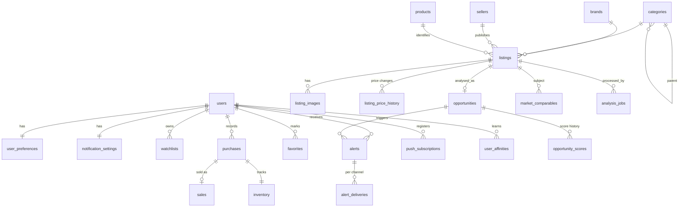

# Vinted FlipFinder — Progettazione tecnica

> Documento di design (deliverable iniziale). Descrive analisi, architettura, modello dati,
> algoritmi e roadmap dell'MVP. Il codice nel repository implementa quanto descritto qui;
> dove l'implementazione diverge, fa fede il codice e questo file va aggiornato.

## 1. Analisi del progetto

**Problema.** Un reseller cerca manualmente articoli economici su Vinted e valuta "a occhio"
se valgono la pena. Il prezzo basso da solo non indica un affare: conta il **divario tra il
prezzo richiesto e il valore di mercato realistico**, al netto di tutti i costi, pesato per
domanda, velocità di vendita e rischio.

**Obiettivo.** Un motore che, per ogni nuovo annuncio:

1. lo normalizza e identifica il prodotto (brand, linea/modello, categoria, taglia, condizione);
2. stima il **Fair Market Value** da comparabili simili (venduti > attivi), escludendo outlier;
3. stima tre prezzi di rivendita (quick / expected / optimistic) e la velocità di vendita;
4. calcola costi totali, profitto netto, ROI e **prezzo massimo d'acquisto** per gli obiettivi dell'utente;
5. assegna **Flip Score**, **Confidence Score** e **Risk Score**, tutti **spiegabili**;
6. notifica l'utente quando un annuncio supera i suoi criteri.

**Vincoli fondamentali.**

- **Nessuna elusione** di CAPTCHA, anti-bot, rate limit o autenticazione. Vinted non espone
  un'API pubblica di ricerca: la sorgente dati è quindi **astratta** (`MarketplaceProvider`) e
  i dati arrivano da ciò che l'utente cattura (estensione, link, email, **import manuale**) e,
  se disponibile, da un adapter **feed JSON autorizzato** (integrazioni/partner/esportazioni
  lecite). Nessun dato simulato (la Demo Mode delle prime versioni è stata rimossa, migrazione 0007).
- **Nessuna azione automatica rischiosa**: niente acquisti, offerte o messaggi automatici.
  Il sistema suggerisce, l'utente decide.
- **Niente black box**: ogni punteggio è scomposto in fattori leggibili.
- **Onestà sull'incertezza**: Confidence separata dal Flip Score; nessuna dichiarazione di
  autenticità senza prove; distinzione *certo / probabile / non verificabile*.

## 2. Architettura proposta

Monorepo con due applicazioni e servizi infrastrutturali:

- **Backend Python (FastAPI)** — API REST documentata (OpenAPI), autenticazione, query, e tutti
  i moduli di dominio (ingestion, identificazione, pricing, scoring, alert, analytics).
- **Worker (arq su Redis)** — pipeline asincrona: scanner periodico, analisi annunci, ricalcolo
  statistiche di mercato, ciclo di vita annunci, consegna notifiche. Due code: `high` (annunci
  con alta probabilità di affare, alert) e `default`. Retry con backoff esponenziale.
- **Frontend Next.js (App Router, React, TypeScript, Tailwind)** — dashboard SaaS mobile-first,
  PWA installabile con service worker e Web Push.
- **PostgreSQL** — fonte di verità (annunci, storico prezzi, comparabili, statistiche, utenti…).
- **Redis** — code di lavoro, cache (statistiche, feed, analytics), rate limiting, ricerche popolari.

Python è stato preferito a Node.js perché il cuore del prodotto è analisi dati/statistica e,
in prospettiva, modelli ML (scikit-learn/LightGBM) che si integrano nativamente.

Principi: **domain modules puri** (funzioni deterministiche e testabili, senza I/O) separati da
**servizi** (I/O, DB, cache) e **adapter** (provider marketplace, canali notifica, LLM).

## 3. Stack tecnologico

| Livello | Tecnologia | Motivo |
|---|---|---|
| API | FastAPI, Pydantic v2, Uvicorn | async, validazione, OpenAPI automatico |
| ORM / DB | SQLAlchemy 2 (async) + asyncpg, Alembic, PostgreSQL 16 (`pg_trgm`) | query tipizzate, migrazioni, ricerca fuzzy su titoli |
| Code / job | arq (Redis) | asyncio nativo, cron al secondo, job id univoci (dedup), retry |
| Cache / rate limit | Redis 7 | latenza bassa, TTL, contatori atomici |
| Auth | Argon2id (argon2-cffi), JWT (PyJWT) in cookie httpOnly + CSRF double-submit | sicurezza standard per SPA same-origin |
| Similarità testo | RapidFuzz | token similarity veloce in C |
| Immagini | Pillow (dHash percettivo, qualità foto), Claude Vision opzionale | dedup immagini e analisi AI |
| AI | Anthropic Claude (opzionale), fallback rule-based deterministico | l'app funziona anche senza chiave |
| Notifiche | in-app, Web Push (VAPID), email (SMTP), Telegram, Discord | canali modulari |
| Log | structlog JSON con redazione segreti | log strutturati e sicuri |
| Frontend | Next.js 16, React 19, TypeScript, Tailwind v4, TanStack Query, Recharts, Radix UI, Sonner | SaaS moderno, dati reattivi, accessibilità |
| Test | pytest + pytest-asyncio + httpx, Postgres reale; Vitest | calcoli finanziari e integrazione end-to-end |
| Deploy | Docker, Docker Compose | `docker compose up` |

## 4. Diagramma dei componenti

```mermaid
flowchart LR
  subgraph Client
    PWA[Next.js PWA<br/>Dashboard / Deal detail / Flips]
    SW[Service Worker<br/>push + offline]
  end

  subgraph Backend[FastAPI]
    API[REST API /api/v1]
    AUTH[Auth & Security<br/>JWT cookie, CSRF, rate limit]
    Q[Query services<br/>feed, filtri, ricerca NL]
  end

  subgraph Workers[arq workers]
    SCAN[Scanner<br/>new listings cron]
    PIPE[Analysis pipeline]
    STATS[Market statistics<br/>recompute]
    LIFE[Listing lifecycle<br/>removed / sold]
    NOTIF[Notification delivery]
  end

  subgraph Domain[Domain modules - puri]
    NORM[Normalizer]
    IDENT[Product identification]
    VIS[Image analysis]
    PRICE[Market price engine<br/>comparables + outlier]
    DEM[Demand & velocity]
    PROF[Profit / ROI / max buy / offers]
    SCORE[Flip / Confidence / Risk / Seller<br/>+ explanation]
    AI[AI Deal Analyst<br/>rule-based / Claude]
    PERS[Learning & personal score]
  end

  subgraph Providers[MarketplaceProvider adapters]
    FEED[Authorized JSON feed]
    MAN[Manual import]
  end

  PG[(PostgreSQL)]
  RD[(Redis)]
  CH[Telegram / Discord / Email / Web Push]

  PWA <--> API
  SW <-- push --- NOTIF
  API --> AUTH
  API --> Q --> PG
  Q --> RD
  SCAN --> Providers
  SCAN --> NORM --> PG
  SCAN -- enqueue --> RD
  RD -- jobs --> PIPE
  PIPE --> IDENT & VIS & PRICE & DEM & PROF & SCORE & AI
  PIPE --> PG
  PIPE -- alerts --> NOTIF --> CH
  STATS --> PG
  LIFE --> Providers
  PERS --> PG
```

## 5. Schema database



Tabelle principali (dettaglio colonne in `backend/app/db/models/`):

| Tabella | Scopo | Vincoli / indici chiave |
|---|---|---|
| `users` | account | `email` unique, `token_version` per revoca sessioni |
| `user_preferences` | obiettivi (min profit/ROI…), brand/categorie/taglie preferite, profilo costi, pesi Flip Score | PK = `user_id` |
| `notification_settings` | canali e soglie alert | PK = `user_id` |
| `brands` | brand canonici, alias, tier, rischio contraffazione | `slug` unique |
| `categories` | albero categorie (categoria/sottocategoria) | `slug` unique, FK `parent_id` |
| `sellers` | venditori + reliability score | unique (`provider`, `external_id`) |
| `products` | prodotto canonico (brand+categoria+modello+genere) | `product_key` unique |
| `listings` | annunci normalizzati + attributi identificati + stato ciclo di vita | unique (`provider`,`external_id`), indici su (brand, category, status), `published_at`, `price`, GIN trigram su `title` |
| `listing_images` | foto + hash percettivo | unique (`listing_id`,`position`), indice su `phash` |
| `listing_price_history` | storico prezzi | indice (`listing_id`,`observed_at`) |
| `market_comparables` | comparabili usati per ogni analisi | unique (`listing_id`,`comparable_listing_id`) |
| `market_statistics` | **Market Database** per segmento (brand×categoria×modello×taglia) | unique `segment_key` |
| `opportunities` | risultato analisi (FMV, scenari, score, spiegazioni, AI) | `listing_id` unique, indici su `flip_score`, `is_active`, `is_ultra_deal` |
| `opportunity_scores` | storico/audit degli score per versione algoritmo | FK cascade |
| `alerts`, `alert_deliveries` | alert e consegne per canale | unique (`user_id`,`dedupe_key`) |
| `watchlists` | strategie personalizzate | FK user |
| `favorites` | save / ignore / purchased / watching / sold | unique (`user_id`,`listing_id`) |
| `purchases`, `sales`, `inventory` | My Flips & portfolio | `sales.purchase_id` unique |
| `user_affinities` | learning engine (per brand/categoria/taglia/fascia prezzo) | unique (`user_id`,`dimension`,`key`) |
| `analysis_jobs` | tracciamento pipeline | indice (`status`,`queued_at`) |
| `push_subscriptions` | Web Push | `endpoint` unique |
| `system_state` | stato chiave/valore (cursor scanner, calibrazione stime) | PK `key` |

## 6. Struttura cartelle

```
.
├── docker-compose.yml        # postgres, redis, backend, worker, frontend
├── .env.example
├── docs/DESIGN.md
├── backend/
│   ├── Dockerfile, pyproject.toml, alembic.ini, alembic/
│   ├── app/
│   │   ├── main.py                 # app factory, middleware, router
│   │   ├── core/                   # config, logging, security, errori, cache, rate limit, money
│   │   ├── db/                     # engine/sessione, modelli ORM
│   │   ├── domain/                 # enum e tipi di dominio condivisi
│   │   ├── marketplace/            # MarketplaceProvider + feed autorizzato
│   │   ├── ingestion/              # normalizzazione, dedup, upsert batch
│   │   ├── identification/         # tassonomia, estrazione attributi, confidence
│   │   ├── vision/                 # hash percettivo, analisi foto (heuristic / Claude)
│   │   ├── pricing/                # statistica robusta, comparabili, FMV, scenari, market DB
│   │   ├── demand/                 # sell-through, velocità
│   │   ├── profit/                 # costi, profitto, ROI, max buy, offer engine
│   │   ├── scoring/                # flip, confidence, risk, seller, spiegazioni, personal
│   │   ├── ai/                     # deal analyst, ricerca in linguaggio naturale
│   │   ├── opportunities/          # pipeline orchestrator + query feed
│   │   ├── alerts/                 # regole, servizio, canali notifica
│   │   ├── analytics/              # brand/categorie, portfolio, learning
│   │   ├── api/v1/                 # router REST
│   │   ├── schemas/                # DTO Pydantic
│   │   └── workers/                # arq: task, cron, runner
│   └── tests/                      # unit / integration / api
└── frontend/
    ├── Dockerfile, package.json, next.config.ts
    ├── public/                     # manifest PWA, service worker, icone
    └── src/
        ├── app/                    # route (dashboard, opportunities, deal detail, …)
        ├── components/             # ui kit, deal, layout, filtri, grafici
        └── lib/                    # api client, tipi, formattazione, hook
```

## 7. Modello dati (concetti di dominio)

- **Listing** — annuncio osservato: dati grezzi normalizzati + attributi identificati
  (`brand_id`, `category_id`, `model_name`, `gender`, `size_normalized`, `condition`…) +
  ciclo di vita `status ∈ {active, reserved, sold, possibly_sold, removed, unknown}`.
  Gli annunci spariti **non vengono eliminati**.
- **Product** — cluster canonico (brand+categoria+modello+genere) a cui collegare gli annunci.
- **Opportunity** — analisi corrente di un listing: FMV, statistiche, scenari, profitto (profilo
  costi di default), score, fattori di spiegazione, rischio, raccomandazione, AI.
- **Cost profile** — parametri costi (protezione acquisti fissa+%, spedizione, commissioni
  vendita, packaging, advertising, pagamento, altri). Profitto e ROI per utente sono
  ricalcolati con **espressioni SQL lineari** sui prezzi salvati, così filtri e ordinamenti
  rispettano i costi personali senza ri-analizzare.
- **Market statistics** — Market Database per segmento, ricalcolato periodicamente.
- **Portfolio** — `purchase` → `inventory` → `sale`; da qui profit, ROI, holding time, win rate
  e il learning engine (`user_affinities`).

## 8. Logica Flip Score

Componenti normalizzate 0–100 con una **curva concava a rendimenti decrescenti** (un valore
estremo non domina, e la componente arriva a 100 a una soglia "eccellente"):

`concave(x, full) = 100·(1 − (1 − min(1, x/full))^1.6)` — es. sconto 10% → 30, 20% → 56, 30% → 77, ≥ 50% → 100.

| Componente | Peso default | Mappatura (implementazione: `backend/app/scoring/`) |
|---|---|---|
| Price undervaluation | 30% | sconto `d = (FMV − prezzo)/FMV`; `concave(d, 0.50)`, 0 se d ≤ 0 |
| Expected ROI | 20% | `concave(ROI, 0.90)` |
| Expected net profit | 15% | `concave(profit, 25 €)` |
| Demand | 15% | `concave(STR, 0.65)` sul sell-through smussato (prior bayesiano) ± 8 punti dal segnale preferiti/giorno dell'annuncio |
| Sales velocity | 10% | `0.8·days_score + 0.2·concave(STR, 0.65)` con `days_score = 100·e^(−max(0, giorni−1.5)/18)` (≈87 a 4 gg, ≈74 a 7, ≈50 a 14) |
| Listing freshness | 5% | `100·e^(−ore/24)` |
| Seller reliability | 5% | rating bayesiano, n. recensioni, anzianità, articoli venduti |

Domanda (sell-through finestrato = venduti / (venduti + ancora attivi) tra i comparabili):
≥ 60% Very High · ≥ 45% High · ≥ 30% Medium · ≥ 15% Low · altrimenti Very Low.
Velocity bucket: 0–3, 4–7, 8–14, 15–30, 30+ giorni.

`base = Σ peso·componente` (pesi configurabili dall'utente e rinormalizzati). **Penalità
sottrattive**, ciascuna con motivazione visibile nella UI:

| Penalità | Punti |
|---|---|
| Rischio falso (si applica solo la più grave): descrizione sospetta / foto riutilizzate da altro venditore / prezzo troppo basso per brand spesso contraffatto (sconto > 55%) / "troppo bello per essere vero" (sconto > 65%) | 15 / 12 / 10 / 8 |
| Condizioni: discrete / buone | 8 / 3 |
| Informazioni insufficienti (identificazione < 50) | fino a 10 |
| Domanda debole (STR < 20%) / contenuta (< 30%) | 8 / 4 |
| Comparabili < 5 / < 10 | 8 / 3 |
| Mercato poco affidabile (dispersione > 0.6 o market confidence < 35) | 6 / 5 |
| Rischio complessivo ≥ 50 | `min(12, (risk − 45)/2.5)` |

Tetti: valore di mercato non stimabile ⇒ max 35; profitto atteso ≤ 0 ⇒ max 30.
Classi: 90–100 Exceptional, 80–89 Excellent, 70–79 Good, 60–69 Moderate, < 60 Low Priority.
Caso di riferimento (prezzo 52% sotto mercato, ROI 73%, domanda forte, ~4 giorni, venditore
affidabile) ⇒ ≈ 91 (verificato da `tests/unit/test_scoring.py`).

**Confidence (0–100)** = 45% affidabilità prezzo di mercato (n comparabili, similarità media,
dispersione, quota venduti, recency) + 25% confidence identificazione + 15% completezza dati
annuncio + 15% profondità dati di domanda.

**Risk (0–100, alto = rischioso)**: somma di fattori motivati — prezzo sospettosamente basso,
brand molto contraffatto, venditore con poco storico (mai trattato come truffatore di default),
rating basso, poche foto, parole chiave sospette ("replica", "simil", "1:1"…), difetti dichiarati
o rilevati, prodotto poco identificabile, comparabili insufficienti.

**Ultra Deal**: Flip > 90 ∧ Confidence > 80 ∧ ROI > 60% ⇒ badge 🔥 e notifica ad alta priorità.

**Personal Flip Score**: Flip globale ± aggiustamento (max ±15) dalle performance reali
dell'utente per brand/categoria/taglia/fascia prezzo, con shrinkage bayesiano sul numero di flip
(attivo da 3 flip completati) e lieve penalità (max −8, mai esclusione) per ciò che ignora spesso.

## 9. Algoritmo comparabili

1. **Candidate pool (SQL, indicizzato)**: stesso brand; stessa categoria (o categorie sorelle
   dello stesso padre); visti negli ultimi 120 giorni; escluso il soggetto e i suoi duplicati.
   Due query limitate: i 200 **venduti** più recenti (per data di vendita) e i 200 **attivi** più
   recenti (per data di pubblicazione), così gli annunci attivi non "spingono fuori" i venduti.
2. **Similarità 0–1** (pesi): categoria esatta .25 / padre .12 · modello .20 (sconosciuto .08) ·
   condizione .15 (adiacente .08) · taglia .12 (adiacente .06) · token del titolo (RapidFuzz) .10 ·
   genere .05 · colore .04 · materiale .04 · paese .03 · (+ bonus vintage coerente).
   Soglia minima 0.5; si tengono i migliori 60.
3. **Peso** = similarità × decadimento recency `e^(−giorni/75)` × 1.5 se **venduto** (prezzo realizzato).
4. **Aggiustamento condizione**: `prezzo·m(cond_soggetto)/m(cond_comp)` con
   m = {NWT 1.15, NWOT 1.08, very good 1.00, good 0.88, satisfactory 0.70}.
5. **Outlier**: su log-prezzi, filtro Tukey (IQR×1.5) + modified z-score (MAD > 3.5); con n < 4
   filtro a rapporto (×3 / ÷3 dalla mediana). Es.: 38…49 + 150 ⇒ 150 escluso.
6. **Statistiche pesate**: mediana, media, P25, P75, P10/P90, min/max ragionevoli.
7. **FMV**: se ≥ 5 venduti → mediana pesata dei venduti; altrimenti blend
   `w·mediana_venduti + (1−w)·mediana_attivi·k_ask` con `w = n_sold/(n_sold+5)` e `k_ask`
   (rapporto venduto/richiesto del segmento, default 0.88).
8. **Scenari di rivendita**: Quick = P25 realizzato · Expected = FMV · Optimistic = P75 (≤ max ragionevole).

## 10. Flusso dati

```
Provider.search_listings(cursor) ─▶ Normalizer ─▶ Dedup (id, URL, titolo+seller, pHash)
   ─▶ upsert batch (listings, images, price_history, sellers)
   ─▶ pre-score economico (prezzo vs mediana segmento in cache) ─▶ coda high | default
   ─▶ analyze_listing: identificazione → (vision) → comparabili → FMV/scenari → domanda/velocità
      → profitto/ROI/max buy/offerte → risk/confidence/flip + spiegazioni → AI analyst
   ─▶ upsert opportunity + opportunity_scores + market_comparables
   ─▶ regole alert (soglie utente, watchlist, ultra deal, price drop) ─▶ consegne per canale
   ─▶ invalidazione cache feed ─▶ dashboard (polling 30s) / push
Cron: market statistics (15 min) · lifecycle annunci (10 min) · learning utenti (30 min)
```

## 11. API design (REST, `/api/v1`, OpenAPI su `/docs`)

| Metodo | Path | Descrizione |
|---|---|---|
| POST | `/auth/register`, `/auth/login`, `/auth/logout` · GET `/auth/me` | sessione (cookie httpOnly + CSRF) o Bearer |
| GET | `/listings`, `/listings/{id}` | annunci con filtri/paginazione |
| POST | `/listings/import` | import manuale (URL + dati) e analisi |
| GET | `/opportunities` | feed con filtri, preset, ordinamento, paginazione |
| GET | `/opportunities/stats` | quick stats |
| GET | `/opportunities/{id}` | analisi completa (comparabili, distribuzione, scenari, rischio, AI…) |
| PUT/DELETE | `/opportunities/{id}/state` | save / ignore / purchased / watching / sold |
| POST | `/opportunities/{id}/ai-analysis` | rigenera analisi AI |
| POST | `/analyze` | analisi ad-hoc o ri-analisi di un listing |
| POST | `/profit/calculate` | calcolatore profitto con i costi dell'utente |
| GET | `/search?q=`, `/search/parse?q=`, `/search/popular` | ricerca in linguaggio naturale |
| GET | `/brands`, `/categories` | cataloghi |
| GET | `/analytics/brands`, `/analytics/categories`, `/analytics/market`, `/analytics/portfolio`, `/analytics/insights` | analytics |
| CRUD | `/watchlists` (+ `/watchlists/{id}/matches`) | strategie |
| CRUD | `/purchases`, `/sales`, GET `/inventory`, GET `/flips` | My Flips |
| GET/POST | `/alerts`, `/alerts/unread-count`, `/alerts/{id}/read`, `/alerts/read-all` | notifiche |
| GET/PUT | `/settings/preferences`, `/settings/notifications` · POST `/settings/notifications/test` | impostazioni |
| GET/POST/DELETE | `/notifications/push/*` | Web Push |
| GET | `/health`, `/health/ready`, `/system/status` · POST `/system/scan` | operatività |

Errori uniformi: `{"error": {"code": "...", "message": "messaggio leggibile", "details": ...}}` —
mai stack trace o eccezioni grezze verso l'utente.

## 12. Roadmap MVP

| Fase | Contenuto | Stato |
|---|---|---|
| 1 — Core | auth, DB + migrazioni, provider abstraction, ingestion, ricerca, dashboard base | ✅ |
| 2 — Price intelligence | comparabili, FMV, scenari, profitto, ROI, max buy | ✅ |
| 3 — Opportunity engine | Flip / Confidence / Risk, ranking, spiegazioni | ✅ |
| 4 — Monitoring | watchlist, scanner, alert (in-app, push, email, Telegram, Discord), price drop | ✅ |
| 5 — AI | identificazione prodotto, analisi immagini, AI Deal Analyst, ricerca NL | ✅ (rule-based + Claude opzionale) |
| 6 — Analytics | My Flips, portfolio, brand/category analytics, learning & personal score | ✅ |
| Next | adapter marketplace autorizzati reali (eBay Browse API, feed partner), modelli ML (probabilità di vendita, prezzo ottimo) tramite l'interfaccia `PricePredictor`, multi-valuta | 🔜 |

### Predisposizione ML

Le stime (prezzo atteso, giorni alla vendita, probabilità di vendita) passano da interfacce
(`pricing.market_value.estimate_market_value`, `demand.velocity`) alimentate da feature già
salvate (`market_comparables`, `market_statistics`, `listing_price_history`, esiti reali in
`sales`). Un modello addestrato potrà sostituire/affiancare lo stimatore statistico senza
cambiare pipeline, API o frontend; `opportunity_scores.algorithm_version` permette A/B e audit.
